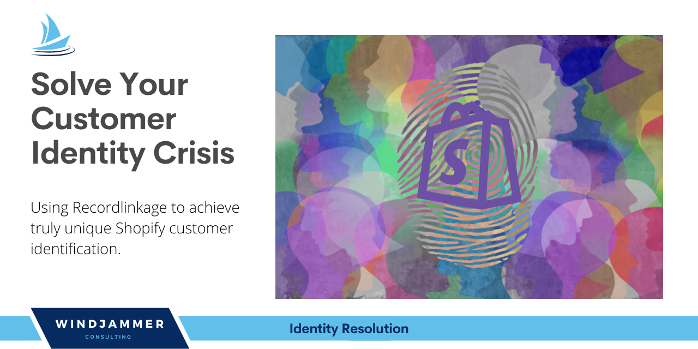

# Windjammer Consulting: Shopify Customer Identity Resolution
**Author**: [Alex FitzGerald](https://www.linkedin.com/in/alex-fitzgerald-0734076a/)

## Overview
This project uses the Recordlinkage Python package to address the challenge of customer identification. I use a processing of potential pair matching and similarity scoring to identify true customer pairs resulting in truly unique customer file. My identity resolution methods resulted in a 

## Business Problem
Many Shopify merchants have use customer file that doesn't accurately reflect their truly unique customers because customers will often be classified as seperate when they are in fact the same customer entering different information. Some misidentifications are accidential resulting from misspellings while others intentionally use different email addresses to access discounts and gated services. This causes business problems for merchants because their customer analytics and marketing personalization are only as good as their customer identity resolution. If you don't know who is who, you can't properly assess key customer metrics like customer lifetime value, customer acquisition cost, churn, etc.

To test out the app for accuracy, Olist has provided a full transaction data set of purchases from all vendors and asked Windjammer Consulting to return CLV predictions with minimal error (RMSE).
If the model passes muster, they want Windjammer Consulting to create an application that allows merchants to upload their own data and retrieve predictions.

## Data
The data used was provided by Recordlinkage for practice purposes which I then manipulated to reflect the Shopify customer data structure. The data included 5,250 customer records with 5,000 truly unique customers as indicated by the Shopify ID which I used as the ground truth. Features used in the similary algorythms included; "First_Name","Last_Name","Date_of_Birth","city","State",and "Address_1".

## Methods
