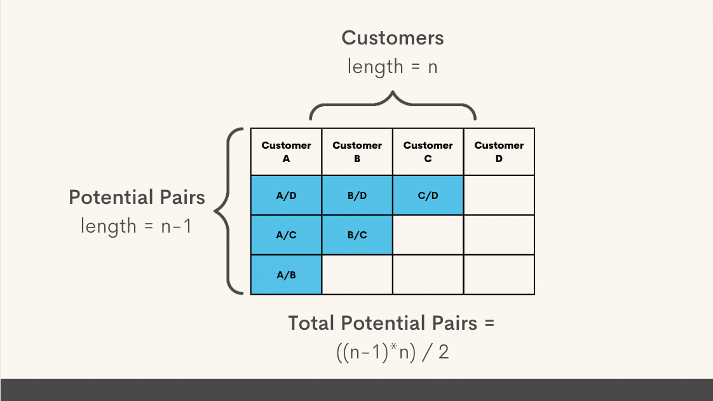
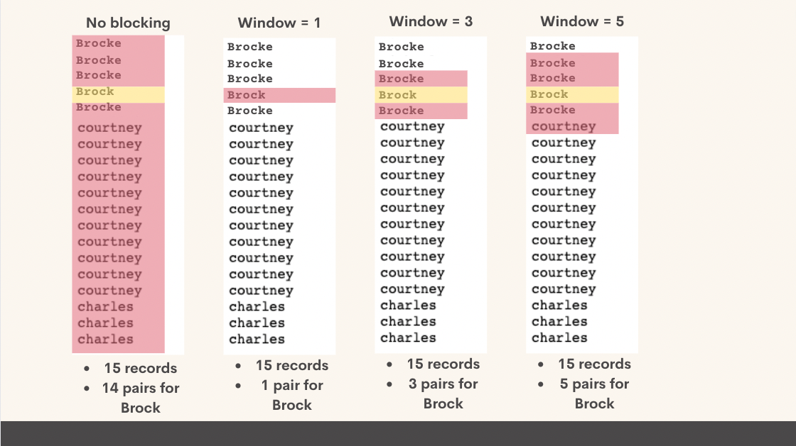
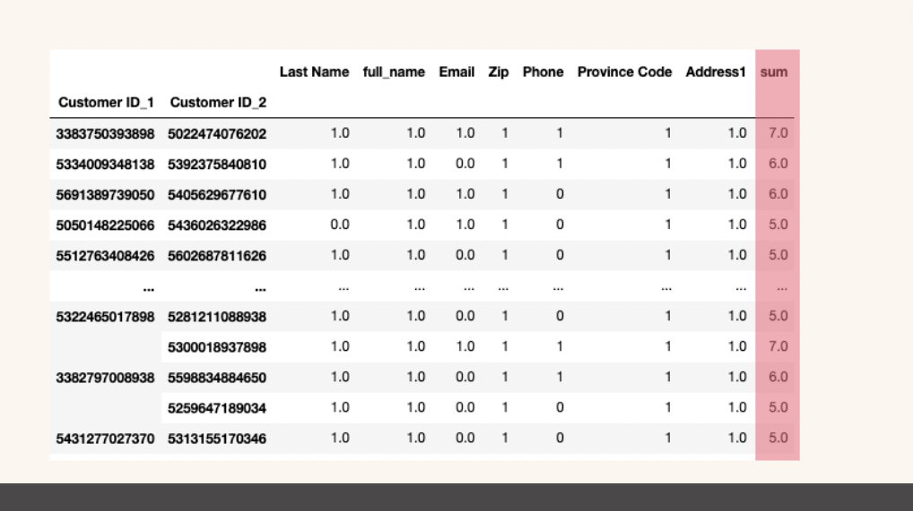
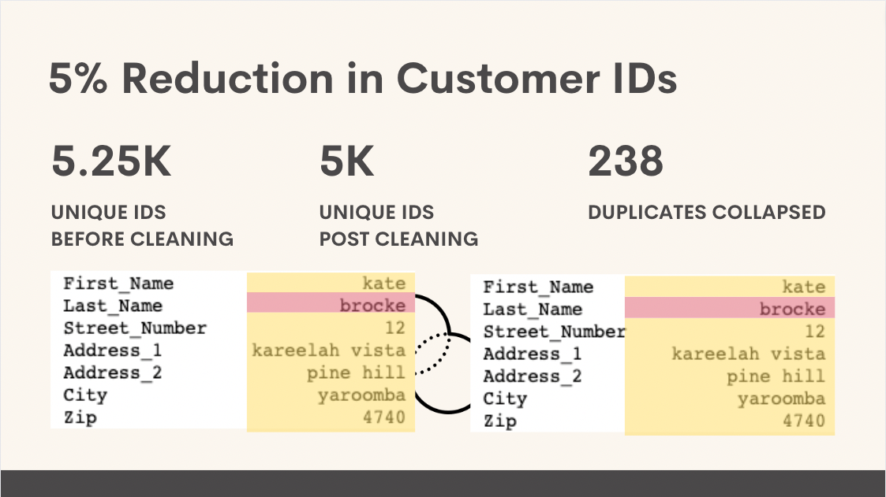
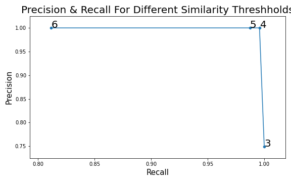

# Windjammer Consulting: Shopify Customer Identity Resolution
**Author**: [Alex FitzGerald](https://www.linkedin.com/in/alex-fitzgerald-0734076a/)


## Overview
This project uses the Record Linkage Python package to address the challenge of customer identification. I use a processing of potential pair matching and similarity scoring to identify true customer pairs resulting in truly unique customer file. My identity resolution methods found 238 duplicate customers resulting in a 5% reduction in the size of the customer file. I achieved a 99% F1 score for this classification problem.

## Business Problem
Many Shopify merchants have a customer file that doesn't accurately reflect their truly unique customers because customers will often be classified as separate when they are in fact the same customer entering different information. Some misidentifications are accidental resulting from misspellings while others intentionally use different email addresses to access discounts and gated services. This causes business problems for merchants because their customer analytics and marketing personalization are only as good as their customer identity resolution. If you don't know who is who, you can't properly assess key customer metrics like customer lifetime value, customer acquisition cost, churn, etc.

## Data
The [data](./Data/processed_data.csv) used was provided by Record Linkage for practice purposes which I then manipulated to reflect the Shopify customer data structure. The data included 5,250 customer records with 5,000 truly unique customers as indicated by the Shopify ID which I used as the ground truth. Features used in the similarity algorithms included; 
* "First_Name"
* "Last_Name"
* "Date_of_Birth"
* "city"
* "State"
* "Address_1".


## Methods
The process I took was uniquely tailored to this data set but the process can be replicated for any Shopify customer file. To replicate these steps, merchants need to consider the following variables and customize them to achieve the best F1 score.

* Blocking feature
* Blocking window
* Comparison algorythms
* Comparison threshholds
* Similarity score threshhold

### Indexing
The first step in the process is to generate a new dataframe where the multi-index represents all possible pairs of the original dataframes. This simple approach assumes that any customer ID could be a match with all other IDs.


### Blocking
We can be smarter about our pairing by eliminating pairs that couldn't possibly be from the same individual. Using a technique called blocking we can tell the indexer object to only create pairs that match some criteria. I chose “first name” but you could also choose another feature.

At this point I brought in some domain knowledge to be more intelligent about blocking. It's very common for customers to misspell their name or provide a nickname on some purchases and a full name on others. To better link these instances of similar names we can use a sorted neighbors algorithm to group names to then be used for blocking.

The process of identified potential pairs using the more discriminating sorted neighborhood process involves three steps

1. Taking the blocking series for each data frame (in our case "first name") and combining them into one series

2. Sorting the series

3. For each element in the series, the function looks within the specified window 

4. If two elements from different series are within the window, they are added to the list of potential pairs.



### Comparing
The compare class and compute methods taken together give you the power to compare your potential links across the dimensions in your data. The process goes like this...

1. Initialize the the Compare class

2. Use Compare methods to specify the type of comparision to make for your different features

3. The compute method uses your comparison methods to create a binary score for potential pairs across shared features

1 indicates a match based on the specified criteria. For example, the 'exact' method will compute 1 only if the potential pairs share a feature exactly.

Exact = Compare features of pairs exactly 

String = Compare string features using one of several possible algorithms
* The jarowinkler formula compares two strings and assigns a similarity score between 0 and 1 with more similar strings closer to 1. The formula values strings that match from the beginning. If the jarowinkler value is above the threshold, the features will be given a score of 1.
* Without specifying a formula, the strings will be evaluated on the number of matching characters, if the ratio of matching characters to total characters is above the threshold, the features will be given a score of 1.

### Scoring
Next, I summed the similarity score horizontally accross all features for each potential pair. Potential pairs with a score of 4 or greater were considered matches, those with a score lower than 4 were considered different customers.


## Results
We reduced the size of our customer file by 238 duplicate customer entries. This was an overall reduction of  5% from the original full length file. Using a combination of sorted neighborhood blocking, similarity ranking algorithms, and similarity score threshold of 4, I was able to achieve a 99% F1 score. I successfully identified 99% of the duplicate customer IDs. Of the IDs that my algorithm identified as matches, 100% were actual matches.




## Conclusion
This project demonstrates the power of the Record Linkage package for resolving Shopify customer identity issues that are very common for merchants. Improper customer identification is a major issue because it limits the accuracy of customer analysis and weakens the effectiveness of marketing personalization. Merchants can follow the steps laid out in these projects, tailoring important elements like feature selection and thresholds to their needs to get a more accurate picture of the truly unique customers in their file.


## Reproduction Instructions
To replicate the environment used for this project, follow the steps below. If you run into issues with this process, please reference the Anaconda Documentation on managing environments.

1. Download the [requirements.txt](./requirements.txt) file
2. Before launching the notebook, execute the below lines of code from the folder containing the environment.yml file:
```
    >>> conda create --name recordlinkage-env python=3.8.5
    >>> conda activate recordlinkage-env
    >>> pip install requirements.txt
 ```   
 
## For More Information

See the full analysis in the [Jupyter Notebook](./ID_resolution_jpnotebook.ipynb)

For additional info, contact [Alex FitzGerald](https://www.linkedin.com/in/alex-fitzgerald-0734076a/)

## Repository Structure

```
├── Data
│   ├──  processed_data.csv
│   ├──  unprocessed_data.csv
├── Visuals
└── .gitignore
└── ID_resolution_jpnotebook.ipynb
└── requirements.txt
└── README.md
```


##
